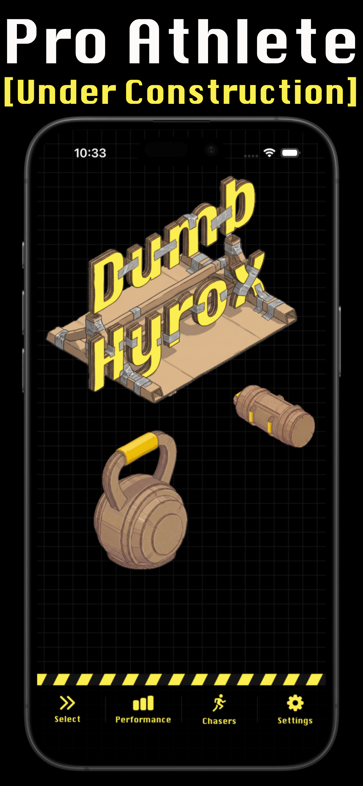
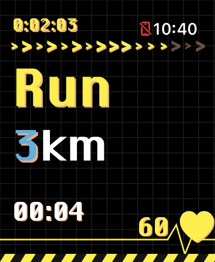

# Dumb Hyrox

**Dumb Hyrox** is an intuitive mobile and watch application designed to help you master your fitness routines and track your progress through intensive workout sessions. Using a clean, high-contrast interface, the app allows you to seamlessly edit workouts on your phone, rearrange your exercises, and track your performance live right from your Apple Watch.

---

## 📱 App Previews

  
  

---

## ✨ Features
DUMB HYROX — ATHLETE UNDER CONSTRUCTION
Stop exercising. Start constructing.
Whether you’re locking in for an official HYROX race or forging the ultimate hybrid physique, Dumb Hyrox is your digital coach, pacer, and competitor. Turn your raw effort into calculated, elite performance.

*⌚ Apple Watch First. Zero Distractions.
This isn't a bloated smartphone app with a weak watch companion. Dumb Hyrox is built native-first for the Apple Watch. No premium paywalls, no afterthoughts. Swipe seamlessly between intervals, track your output, and control your entire session entirely from your wrist. Your phone stays in your locker.

*🏋️ Built for the Chaos of Busy Gyms
No track? Packed commercial gym? Equipment hogged? No excuses. Dumb Hyrox is engineered for real-world training environments. If a treadmill or station is taken, rearrange your entire workout on the fly directly from your wrist. Keep your heart rate redlined without missing a beat.

*🏁 Be the One They Fear: Race Real Ghosts
Stop training in a vacuum. Chase down virtual competitors driven by real-world data from over 15,000 actual HYROX athletes.
* Select your exact division.
* Choose your target threshold (Top 5%, Top 20%, or Competitive Average).
* Push past your limits as you hunt down real times.
Because the data is real, your simulated performance translates perfectly to the actual race floor.

*👥 Become the Benchmark
Don't just chase—lead. Broadcast your personal bests to your crew. Convert your hardest workouts into “chasers” and challenge your friends to step up, match your pace, and try to hunt you down.

Download Dumb Hyrox today.
---

## 🛠️ Support
If you encounter any issues, have questions about managing your workouts, or would like to suggest a new feature, please reach out to us. 

**Contact Email**: [parrottdev@icloud.com](mailto:parrottdev@icloud.com)

---

## 🔒 Privacy Policy
Dumb Hyrox values your privacy. 
* **Data Collection**: We do not collect personally identifiable information unless you voluntarily provide it for support purposes. Health and workout data are only accessed with your explicit permission via Apple HealthKit.
* **Local Processing**: All custom routines and workout histories are processed and stored locally on your device or in your private iCloud.
* **Third Parties**: We do not sell or trade your data with third parties.

For a detailed look at our privacy practices, please contact us at the support email provided above.
